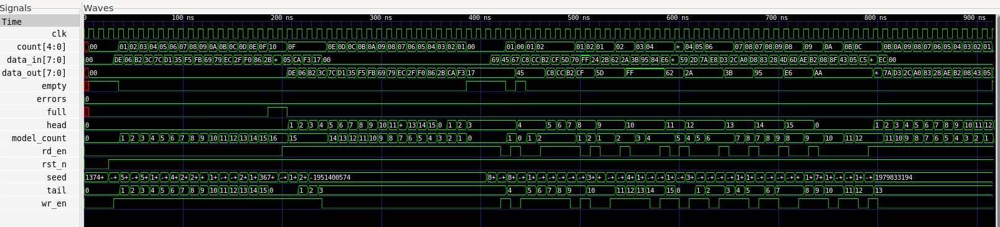

# FIFO UVM Verification

## Verification status

The portable smoke flow includes `fifo_checker.sv` and is defined for Icarus Verilog. It was not executed here because Icarus was not installed. The UVM environment and SVA interface are written for a UVM-capable simulator and were not run here.

## Repository

This repository contains the RTL/testbench/automation sources for the project. Review fixes are summarized in the package-level `CHANGES.md`.

# Synchronous FIFO UVM Verification

This is my second SystemVerilog verification project.

I designed and verified a parameterized synchronous FIFO using Icarus Verilog and GTKWave. I also created a UVM verification structure to demonstrate a reusable verification environment.

The FIFO supports:

* Write and read operations
* Full and empty status
* Overflow and underflow protection
* Simultaneous read and write
* Parameterized data width and FIFO depth

I created a self-checking testbench with a queue-based reference model. The testbench fills the FIFO, checks the full condition, attempts overflow, performs simultaneous reads and writes, drains the FIFO, checks the empty condition, attempts underflow, and runs randomized operations.

## Test Result

The simulation completed successfully:

* 134 automatic checks passed
* 0 errors
* GitHub Actions CI passed

```text
FIFO_TEST_PASS checks=134
```

## Project Files

* `rtl/sync_fifo.sv` – Synchronous FIFO RTL
* `tb/smoke/fifo_tb.sv` – Self-checking testbench
* `tb/uvm/` – UVM sequence, driver, monitor, scoreboard, coverage, environment, and test
* `docs/test_plan.md` – Verification test plan
* `proof/fifo_test.log` – Simulation result
* `proof/fifo_waveform.png` – Waveform proof

## Waveform

The waveform shows FIFO reset, write and read operations, full and empty conditions, simultaneous read/write activity, and the self-checking reference model.



## Tools Used

* SystemVerilog
* Icarus Verilog
* GTKWave
* GitHub Actions
* Git
